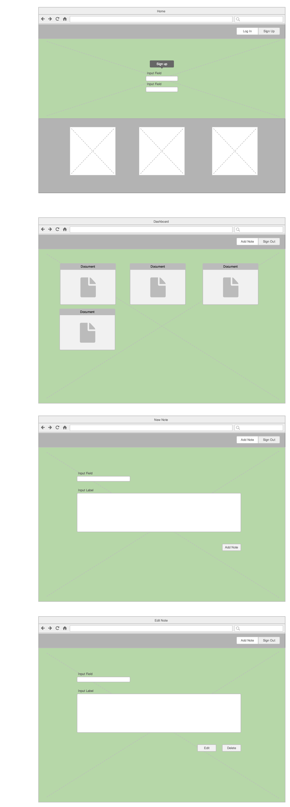

#Project 2 - Notebook App

Notebook is an app that allows a user to take notes and save their notes in their account. It is a simple tool that is user friendly and easy to use.

[User Stories](https://docs.google.com/spreadsheets/d/1AD2vXm5q34kl7VO6D2g7QRJ3qRNX0NM0-ivXlfY96zU/edit?usp=sharing)

[ERD](https://drive.google.com/file/d/0B6PevIwoQhmNSmlybjBfMllaZVE/view?usp=sharing)
I

